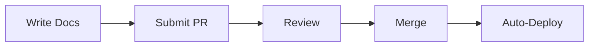

# {{COMPANY_NAME}} Documentation

Welcome to our centralized documentation repository. This repository contains all technical and operational documentation for {{COMPANY_NAME}}.

## 📚 Quick Navigation

| Section | Description | Primary Audience |
|---------|-------------|------------------|
| [Policies](./docs/policies/) | Company policies and governance | All staff |
| [Procedures](./docs/procedures/) | Standard operating procedures | Operations team |
| [Architecture](./docs/architecture/) | System design and technical specs | Engineering |
| [Guides](./docs/guides/) | How-to guides and tutorials | All technical staff |
| [References](./docs/references/) | API docs, glossaries, references | Developers |

## 📖 Repository Documentation

- [How this repo is structured](./.github/DOCUMENTATION/setup-guide.md)
- [Our docs-as-code approach](./.github/DOCUMENTATION/docs-as-code-strategy.md)
- [Contributing guidelines](./CONTRIBUTING.md)

## 🚀 Getting Started

### Quick Setup

```bash
# Clone the repository
git clone https://github.com/{{GITHUB_ORG}}/{{REPO_NAME}}.git
cd {{REPO_NAME}}

# Install dependencies
npm install

# Run initialization (first time only)
npm run init

# Validate setup
npm run test:setup
```

### For Non-Technical Contributors

If you prefer a graphical interface, you can use:
- **GitHub Web Editor**: Edit files directly on GitHub.com
- **Obsidian**: Download [Obsidian](https://obsidian.md) and open this repository as a vault
- **VS Code**: Use [VS Code](https://code.visualstudio.com) with the Markdown Preview extension

## 🛠️ Available Commands

```bash
npm run lint        # Fix markdown formatting issues
npm run spell       # Check spelling
npm run links       # Validate all links
npm run validate    # Run all checks
npm run serve       # Preview documentation locally
npm run build:pdf   # Generate PDF versions
```

## 📝 Writing Documentation

### Quick Start

1. Create a new `.md` file in the appropriate directory
2. Use one of our [templates](./docs/templates/) as a starting point
3. Follow our [style guide](./.github/DOCUMENTATION/docs-as-code-strategy.md#style-guide)
4. Submit a pull request for review

### Mermaid Diagrams

We support Mermaid diagrams for flowcharts, sequence diagrams, and more:



## 🤝 Contributing

Please read our [Contributing Guidelines](./CONTRIBUTING.md) before submitting changes.

### Workflow

1. **Branch**: Create a feature branch from `main`
2. **Write**: Make your documentation changes
3. **Test**: Run `npm run validate` locally
4. **PR**: Submit a pull request
5. **Review**: Address feedback from reviewers
6. **Merge**: Once approved, your changes will be merged

## 📞 Support

- **Slack**: {{SLACK_CHANNEL}}
- **Email**: {{DOCS_EMAIL}}
- **Issues**: [GitHub Issues](https://github.com/{{GITHUB_ORG}}/{{REPO_NAME}}/issues)

## 📄 License

This documentation is licensed under [CC BY-SA 4.0](./LICENSE.md).

---

*This repository uses the [docs-as-code](https://www.writethedocs.org/guide/docs-as-code/) approach. All documentation is version controlled, peer reviewed, and continuously deployed.*
